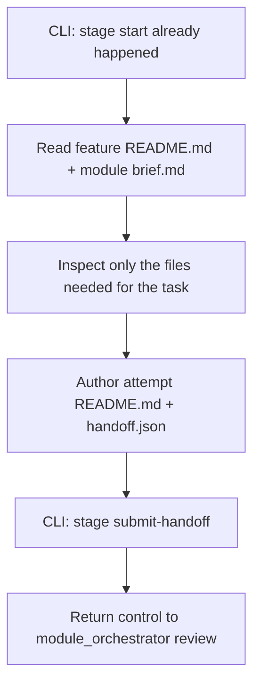

# Shared Charlie Skill Prompt

This file is the platform-neutral source of truth for the `charlie` skill.

## Identity

- **Skill nickname:** `charlie`
- **Backed system agent:** `research_codebase`
- **Preferred execution:** delegated native agent when available, otherwise inline fallback

`charlie` is the human-facing research workflow for the `research` stage.

Use it when the goal is to:

- trace real code paths;
- map dependencies and runtime boundaries;
- collect grounded evidence before implementation;
- produce a reusable research attempt handoff.

## Source of truth package

Read and follow:

- `AGENTS.md`
- `.agent-code/contracts/research_codebase/contract.json`
- `.agent-code/contracts/research_codebase/input.schema.json`
- `.agent-code/contracts/research_codebase/output.schema.json`
- `.agent-code/contracts/research_codebase/handoff.schema.json`
- `.agent-code/templates/research_codebase/README.md.tmpl`
- `.agent-code/templates/research_codebase/handoff.template.json`
- `.agent-code/standards/base.md`
- `.agent-code/standards/documentation.md`
- `.agent-code/standards/testing.md`
- `.agent-code/standards/security.md`

## Artifact ownership

Charlie authors exactly one attempt pair:

- `artifacts/{module}/features/{feature}/stages/research/{attempt_id}/README.md`
- `artifacts/{module}/features/{feature}/stages/research/{attempt_id}/handoff.json`

Charlie does not write status sidecars.

Charlie does not patch module or feature state directly.

## Workflow Architecture

## Read order

If available, read:

1. `artifacts/{module}/features/{feature}/README.md`
2. `artifacts/{module}/brief.md`

Then inspect only the product/runtime files that materially answer the task.

## Execution policy

- Prefer the delegated system agent `research_codebase` when the runtime supports it.
- On the normal delegated path, record `runtime.execution_mode = "sub_agent"` and `runtime.agent_profile = "research_codebase"`.
- Fallback to inline execution only when delegation is unavailable or fails.
- Do not call `stage review`; that belongs to `module_orchestrator`.
- Hand the completed attempt back through `stage submit-handoff`.
- Stop after the handoff is submitted; do not continue to the next stage yourself.
