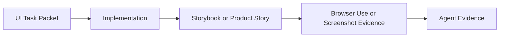

# UI TASK PACKET

Use this packet for non-trivial visible UI work.
It may be pasted into a chat, embedded in an Atlas run lane packet, or kept
inside a run file. Do not create a separate persistent file for tiny tasks.

Tiny UI changes may skip this packet when the work is limited to copy,
one small spacing tweak, or a single obvious CSS bug and no new state coverage
is needed.

## Workflow



## Packet

```md
# UI Task Packet

Route:
Target surface:
App/package:
Persona:
Primary job-to-be-done:
Current pain:
Target behavior:

Required states:
- loading:
- empty:
- error:
- ready:
- disabled / locked / pending:
- long content:
- mobile / narrow viewport:
- other:

Visual acceptance:
- No horizontal overflow.
- Primary action is visible and semantically clear.
- Empty state explains the next action.
- Errors appear near the field or action that caused them.
- Keyboard/focus behavior is not obviously broken.
- i18n text does not overflow in expected states.

Do not change:
- Backend/API/storage contracts:
- Auth/tenancy/route guards:
- Shared package boundaries:
- Product scope exclusions:

Evidence required:
- Storybook story or product state:
- Browser Use local smoke or screenshot:
- Checks:

Memory/docs expectation:
- Durable memory update expected: yes | no
- Canonical docs update expected: yes | no
```

## Form Builder Example

```md
# UI Task Packet

Route: FE_ONLY or DIRECT_FRONTEND_NO_RUN
Target surface: Form Builder inspector
App/package: platform/frontend/apps/tenant-web
Persona: tenant admin building a model view
Primary job-to-be-done: adjust selected field settings quickly and safely
Current pain: selected field settings are hard to scan
Target behavior: primary field settings are visible first; destructive actions
are separated; helper copy explains locked fields

Required states:
- no selection
- field selected
- grid selected
- rule dialog open
- save pending
- validation error

Visual acceptance:
- No horizontal overflow.
- Primary field label/helper text is visible above fold.
- Destructive action is visually separated.
- Locked-field explanation is visible when editing is blocked.
- Screenshot or Browser Use evidence covers at least editable and locked states.

Do not change:
- Backend/API/storage/Form Builder contract.
- Auth, tenancy, route guards, or runtime grants.
- Planned Platform Studio tools outside Form Builder.

Evidence required:
- Storybook story or product state: product state is acceptable until Form
  Builder stories exist.
- Browser Use local smoke or screenshot: required unless blocked.
- Checks: targeted frontend checks and broader preflight when practical.

Memory/docs expectation:
- Durable memory update expected: no, unless a new UI/product decision appears.
- Canonical docs update expected: no, unless the UI contract changes.
```
