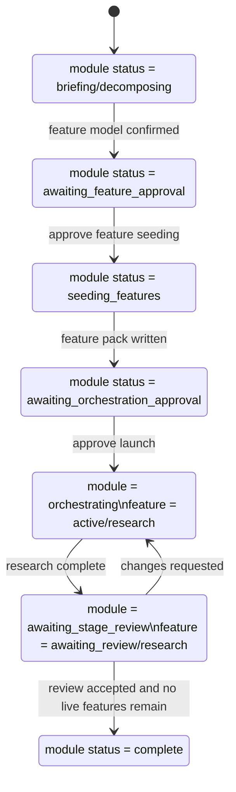

# Maestro Status Model

Status: Canonical current-state state model.

## Goal

This document defines the current state model for:

- module-root orchestration status
- feature-root lifecycle status
- the first real downstream loop: `seed_features -> research -> Maestro review gate`

## Workflow Architecture



## Module-Root Status

File:

- `artifacts/{module}/status.json`

Top-level `status` is the module phase.

| Status | Meaning |
| --- | --- |
| `pending` | Request exists but work has not started. |
| `collecting_context` | `Maestro` is reading package context and rules. |
| `briefing` | Open questions still exist. |
| `decomposing` | Feature model is being shaped but not locked. |
| `awaiting_feature_approval` | Feature model is ready and explicit seeding approval is still missing. |
| `ready_to_seed` | Briefing is closed and seeding can be approved. |
| `seeding_features` | Feature root packs are being written. |
| `seeded` | Feature root packs exist. |
| `awaiting_orchestration_approval` | Seeding is done and launch approval is still missing. |
| `ready_to_orchestrate` | Launch is approved and dispatch can begin. |
| `orchestrating` | A downstream stage is in progress. |
| `awaiting_stage_review` | The current downstream stage is complete and waiting for a Maestro review gate. |
| `blocked` | A blocker prevents further progress. |
| `complete` | Module orchestration is finished. |
| `failed` | Module orchestration failed. |

## Pending User Decision

`interaction.pending_user_decision` should be one of:

| Value | Meaning |
| --- | --- |
| `continue_briefing` | The owner still needs to answer briefing questions. |
| `approve_feature_seeding` | Briefing is ready; seeding approval is the next owner action. |
| `approve_orchestration_launch` | Features are seeded; launch approval is the next owner action. |
| `review_stage_output` | A downstream stage finished and the next action is review. |
| `none` | No immediate owner decision is pending. |

Approval gates are decisions, not blockers:

- if the module is waiting only for `approve_feature_seeding`, then `open_questions_count = 0`, `blockers_count = 0`, and `open_questions_blocking = false`
- if the module is waiting only for `approve_orchestration_launch`, the same rule applies

## Module Feature Rollup

`decomposition.features[*].state` is the module-level rollup for each feature.

| State | Meaning |
| --- | --- |
| `candidate` | The feature is only a candidate; owner approval is not fixed. |
| `approved` | The feature boundary is confirmed but not seeded yet. |
| `seeded` | The feature root pack exists and is waiting for downstream dispatch. |
| `active` | The current downstream stage is running. |
| `awaiting_review` | The current downstream stage is complete and waiting for a Maestro review gate. |
| `blocked` | The feature is blocked in the current stage. |
| `complete` | The feature is done. |
| `failed` | The feature failed and needs intervention. |

## Rollup Counts

The current counters are cumulative:

- `candidate_feature_count`: total recorded feature count
- `approved_feature_count`: features that are owner-approved or further
- `seeded_feature_count`: features whose root pack exists or further
- `completed_feature_count`: features in `complete`
- `orchestration.active_feature_count`: features that are still live in orchestration (`seeded`, `active`, `awaiting_review`, `blocked`)

## Orchestration Substate

`status.orchestration` carries the live downstream control-plane state.

| Field | Meaning |
| --- | --- |
| `launch_status` | Overall launch progress for the current loop. |
| `active_stage` | The current downstream stage, or `null` if none is active or under review. |
| `recommended_entry_agent` | Which downstream agent is expected to start the next loop. |
| `active_feature_count` | Count of features still live in orchestration. |

`launch_status` values:

| Value | Meaning |
| --- | --- |
| `not_requested` | No launch has been requested. |
| `awaiting_approval` | Launch is blocked on explicit owner approval. |
| `approved` | Launch is approved but not yet dispatched. |
| `started` | Dispatch has started. |
| `in_progress` | The downstream stage is currently running. |
| `awaiting_review` | The downstream stage is complete and is waiting for a Maestro review gate. |
| `complete` | The current orchestration loop is complete. |

## Dispatch Contract

`Maestro` should dispatch downstream stages from a small role/profile contract, not by rereading the full downstream package during ordinary launch.

Current first-loop example:

- stage: `research`
- native role/profile: `research_codebase`
- contract files: `.codex/config.toml`, `.codex/agents/research_codebase.toml`

Inline fallback is allowed only when native downstream dispatch is unavailable.
If fallback is used, the downstream stage must record it honestly in its own `runtime.execution_mode` and `runtime.agent_profile` fields.

## Feature-Root Status

File:

- `artifacts/{module}/{feature}/status.json`

Feature-root status is intentionally smaller than module-root status.

Fields:

- `status`
- `current_stage`
- `next_stage`
- `gate`

### Feature `status`

| Value | Meaning |
| --- | --- |
| `queued` | Waiting to be dispatched into the next stage. |
| `active` | The current stage is running. |
| `awaiting_review` | The current stage finished and is waiting for Maestro review. |
| `blocked` | Work is blocked or changes were requested. |
| `complete` | Feature is done. |
| `failed` | Feature execution failed. |

### Feature `gate`

| Value | Meaning |
| --- | --- |
| `awaiting_owner_approval` | Owner approval is still required before dispatch. |
| `approved_for_dispatch` | Launch approval exists and dispatch may begin. |
| `in_progress` | The current stage is actively running. |
| `awaiting_maestro_review` | The current stage is complete and is waiting for a review gate. |
| `changes_requested` | The stage output was reviewed and must be reworked. |
| `none` | No special gate is active. |

## Canonical First Loop

The first real loop should use these canonical states:

| Moment | `status` | `current_stage` | `next_stage` | `gate` |
| --- | --- | --- | --- | --- |
| right after seeding | `queued` | `seeded` | `research` | `awaiting_owner_approval` |
| launch approved, before dispatch | `queued` | `seeded` | `research` | `approved_for_dispatch` |
| research running | `active` | `research` | `design` | `in_progress` |
| research complete, waiting for review | `awaiting_review` | `research` | `design` | `awaiting_maestro_review` |
| research changes requested | `blocked` | `research` | `research` | `changes_requested` |
| feature done | `complete` | `done` | `null` | `none` |

## Review Gate Rule

This is the main orchestration rule:

- stage agents decide what they found
- `Maestro` decides whether the system is allowed to continue
- no downstream stage may be auto-launched after Research completes

So even if `research/status.json` says the next likely stage is `design`, the feature must still pass through:

1. feature-root `gate = awaiting_maestro_review`
2. module-root `status = awaiting_stage_review`
3. owner and/or Maestro review

Only after that review may the next stage be considered.

## Validation Rule

After any change to module-root or feature-root Maestro artifacts:

```bash
node .agent-cli/bin/agent-stack.mjs validate-module module_orchestrator --module "<module>" --write-status
```

If that command fails, the state model must be repaired before continuing.
