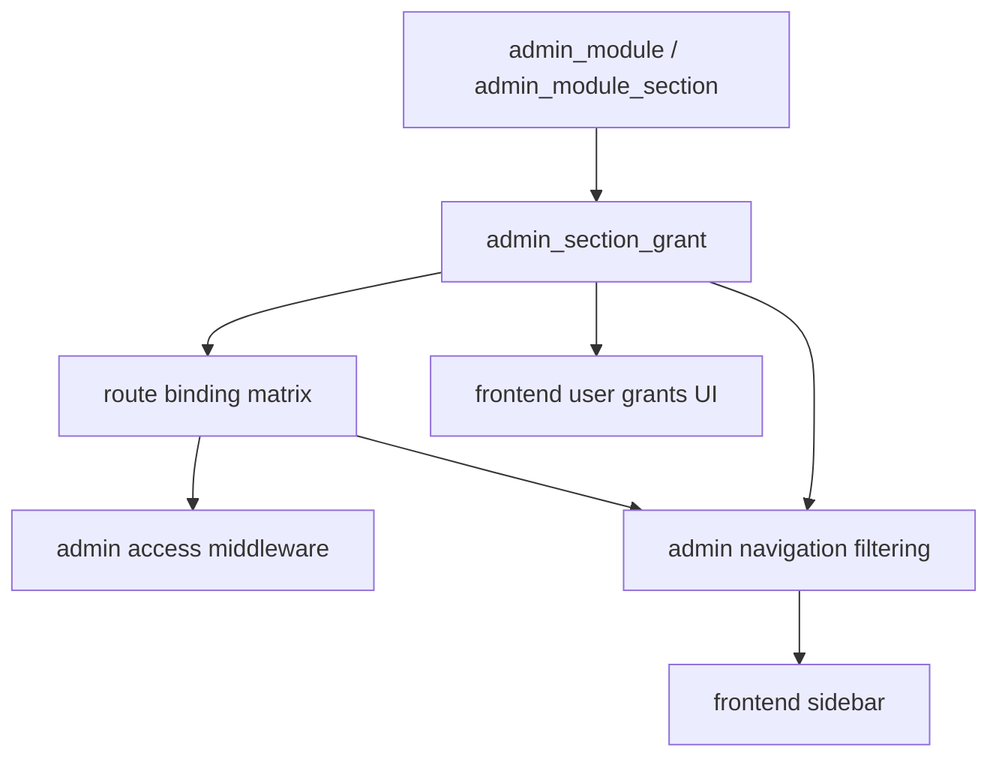

# Backend Admin Access Policy Layering

Status: accepted working explanation  
Date: 2026-04-02

## Goal

Explain why admin access control currently uses both:

- dynamic module and section records in the database
- an explicit route-to-section binding layer in code

And explain what still remains to fully close `Phase 5`.

## Short Answer

These layers solve different problems:

1. Database layer answers:
   - what modules exist
   - what sections exist
   - which admin user has which grant

2. Route-binding layer answers:
   - which secure backend route belongs to which section
   - whether a route is `self`, `section`, or `root-only`
   - which access mode is required for that route

Without the route-binding layer, the backend would know that a section exists, but it would not know which concrete secured API route that section is supposed to unlock.

## Layered Model

## Layer Responsibilities

### 1. Database

Database is the source of truth for configurable control-plane data:

- `admin_module`
- `admin_module_section`
- `admin_section_grant`

This layer is responsible for:

- the canonical module catalog
- the canonical section catalog
- grant assignment per admin user

This layer does **not** know backend route ids such as:

- `ADMIN_TENANT_CREATE`
- `ADMIN_MODULE_REGISTRY_MODULE_UPDATE`

Those are application-runtime identifiers, not database entities.

### 2. Route Binding

Current route binding lives in:

- [`platform/backend/modules/admin/accesspolicy/matrix.go`](/Volumes/HD/Projects/github/firstkb/core-agent/platform/backend/modules/admin/accesspolicy/matrix.go)

This layer answers:

- which route maps to which section
- what access mode is required
- whether the route is self-allowed or root-only

Current examples:

- `ADMIN_PROFILE_GET` -> self
- `ADMIN_NAVIGATION_GET` -> self
- `ADMIN_MODULE_REGISTRY_*` -> `module_registry.modules_list`, root-only
- `ADMIN_TENANT_CREATE` -> `tenant.onboarding`, `write`

This layer exists because:

- route ids live in code
- secure route behavior lives in code
- the backend needs an explicit allowlist for what is actually implemented

## Why The Database Alone Is Not Enough

If the backend used only database grants without route binding, it would not know:

- which section unlocks which API route
- whether a section is backed by any real secure endpoint at all
- whether a route requires `read` or `write`

That would create two risks:

1. navigation could expose sections with no real backend route coverage
2. middleware could not safely authorize a secure route from grants alone

The current explicit route-binding layer prevents both problems.

## Why Navigation Uses The Same Binding Layer

Navigation should only show sections that the backend can actually authorize.

That is why navigation now filters section visibility through the same route-binding source used by middleware.

This prevents cases like:

- a section exists in `admin_module_section`
- a user has a grant for it
- but no secure route policy exists yet

In that case, the section stays hidden until route coverage is real.

Current root-only example:

- `tenant.list_of_tenants` now has an explicit root-only route family at `/app/admin/tenants/list/*`
- that route coverage is what allows `/admin/tenants` to appear in root navigation and favorites
- the non-root rule does not change: no non-root sidebar exposure without secure route coverage

## Frontend Grants UI

The future admin-user grants UI should remain database-driven:

- list available modules and sections from the registry
- assign `read` or `write`
- save section-level grants into `admin_section_grant`

But that UI should still respect backend route coverage:

- if a section has no real route coverage yet, granting it should be treated as incomplete rollout state
- ideally the UI should later show whether a section is:
  - implemented and mappable
  - visible in navigation
  - fully enforced by middleware

## Why `matrix.go` Is Acceptable Right Now

At the current stage, the secure admin route surface is still small.

Keeping route binding in code is currently the safest option because:

- route ids already live in code
- policy review stays explicit
- default-deny remains simple
- partially implemented sections do not accidentally become active

This is intentionally conservative.

## Future Option

If admin non-root coverage becomes broad enough, the route-binding layer can later become data-driven through a separate table, for example:

- `admin_section_route_policy`
  - `route_id`
  - `module_key`
  - `section_key`
  - `required_access`
  - `requirement_kind`

But this should be a separate decision.

It is not required to finish the current rollout safely.

## What Is Still Needed To Fully Close Phase 5

`Phase 5` is now closed for the current approved non-root rollout slice.

Current approved slice:

- `tenant.onboarding`

That slice is fully wired through:

- database section grants
- route binding
- middleware
- navigation filtering
- end-to-end verification

Future work after Phase 5 is expansion work, not a blocker for the current slice.

The remaining work for later slices is:

1. Define the next approved non-root admin feature slice.
   - Decide which additional admin features should work for non-root users.

2. Expand the route-to-section matrix only for real implemented features.
   - Add secure route bindings for each newly approved non-root route.

3. Align seeded sections and route paths with real backend coverage.
   - Do not expose sections in navigation unless secure route coverage exists.

4. Run end-to-end verification for each new granted non-root route.
   - confirm sidebar visibility
   - confirm allowed route succeeds
   - confirm denied route returns forbidden

5. Decide later whether a third access mode such as `delete` is truly needed.
   - do not add it before a real destructive non-root route requires narrower control than `write`

## Current Practical Closure Condition For Phase 5

For any rollout slice, `Phase 5` can be treated as fully closed when:

- every intended non-root admin section in the current rollout slice has real route coverage
- navigation exposes only covered sections
- middleware and navigation both read from the same approved route-binding source
- granted non-root behavior is verified end to end

Until then, `Phase 5` should remain marked as partially completed.
